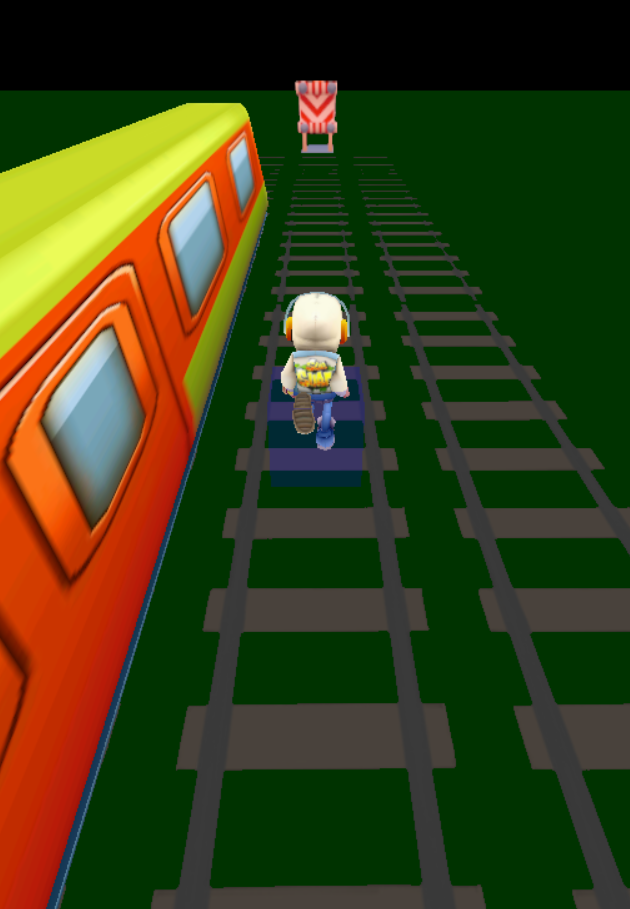

# Surfers

A 3D endless runner game inspired by Subway Surfers, built with Three.js.

🚧 UNDER CONSTRUCTION 🚧

<!-- screenshot -->

## Features

- Endless running gameplay with procedurally generated obstacles
- Multiple lanes with track switching
- Jump and duck mechanics to avoid obstacles
- Character animations including running, jumping, ducking, and death
- Multiple camera views (follow camera and orbit camera)
- Touch controls for mobile devices
- Collision detection and physics
- 3D models and textures
- Responsive design

## Controls

- **W** or **Forward** - Start/Stop running
- **A/D** or **Left/Right Arrow Keys** - Switch lanes
- **Up Arrow** - Jump
- **Down Arrow** - Duck/Slide
- **C** - Toggle camera view
- **Shift + C** - Reset orbit camera
- **R** - Restart game

Mobile users can use swipe gestures:
- Swipe left/right to switch lanes
- Swipe up to jump
- Swipe down to duck/slide

## Technologies Used

- [Three.js](https://threejs.org/) - 3D graphics library
- [Tween.js](https://github.com/tweenjs/tween.js/) - Animation library
- [Hammer.js](https://hammerjs.github.io/) - Touch gestures
- Various Three.js loaders (FBX, GLTF, MTL, OBJ) for 3D models
- ES6 Modules

## Project Structure

- `js/` - JavaScript source files
	- `action.js` - Update loop
	- `canvas.js` - Canvas setup
	- `controls.js` - Input handling
	- `gui.js` - GUI
	- `loader.js` - Asset loading
	- `main.js` - Entry point
	- `obstacles.js` - Obstacle generation
	- `player.js` - Player controls and physics
	- `scene.js` - Scene setup and management
	- `trains.js` - Train logic
	- `world.js` - Game state and configuration
- `assets/` - 3D models, textures, and other assets

## How to run

Just open the `index.html` via a local server.